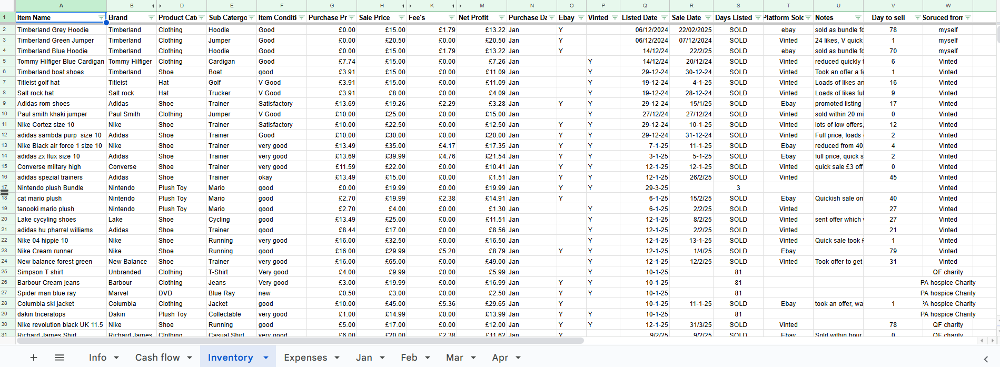
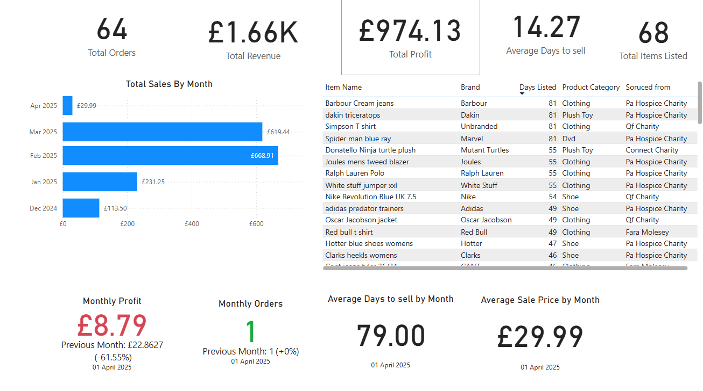
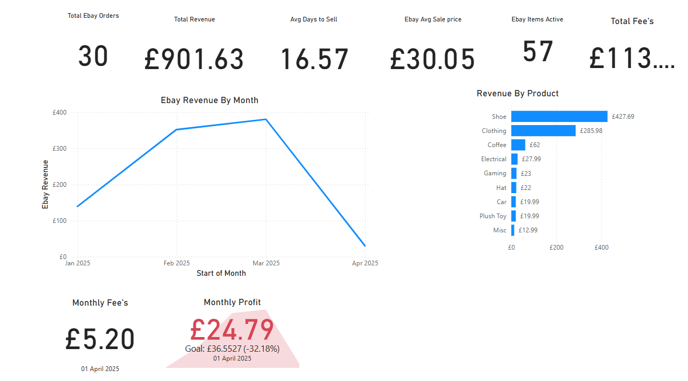

# Reselling Dashboard Project

This repository contains my Power BI dashboard project designed to track and analyze the performance of my reselling business. The dashboard provides insights into **sales trends**, **profit margins**, **inventory management**, and **platform performance**, helping to make data-driven decisions for optimizing sales and profitability.

You can go directly to the report here - https://app.powerbi.com/links/LgNLwEKZej?ctid=515a8d85-4e1e-464f-b7e4-90fbac5d7493&pbi_source=linkShare

## 📌 Project Scope

The objective was to build a dashboard that consolidates data from various reselling platforms and provides **key performance metrics** and **visualizations** to track business growth and profitability. The Data comes from a google sheet which is constantly being updated. I have made it so the report updates every day to pull in the latest data.

### 🔹 Key Tasks & Techniques Used

### 1️⃣ Data Collection & Transformation

- Consolidating sales data from multiple reselling platforms (e.g., Vinted, eBay, Depop).
- Cleaning and preparing data using **Power Query** to ensure consistency and accuracy.
- Creating calculated columns to track **profit per item**, **cost of goods sold (COGS)**, and **fees per platform**.

### 2️⃣ Data Modeling & Relationships

- Structuring data into **fact and dimension tables** to optimize performance.
- Establishing relationships between **sales data**, **product inventory**, and **platform information**.
- Using **unique identifiers** to ensure accurate data linking.

### 3️⃣ Custom Measures with DAX

- Developing measures to calculate:
  - **Total Revenue**
  - **Total Profit**
  - **Profit Margin**
  - **Average Sale Price**
  - **Platform Fees**
- Implementing time intelligence functions to track **monthly and yearly sales trends**.
- Creating **dynamic metrics** to compare performance across different platforms.

### 4️⃣ Building an Interactive Reselling Dashboard

- Designing a **user-friendly layout** with clear visual representation of key metrics.
- Using visuals like **bar charts, line graphs, pie charts, and KPI cards**.
- Adding **filters and slicers** to drill down by platform, product category, and time period.
- Applying **conditional formatting** to highlight high- and low-performing items.

## 🛠️ Tools Used

- **Power BI** – Dashboard creation and data visualization.
- **Power Query** – Data cleaning and transformation.
- **DAX (Data Analysis Expressions)** – Custom calculations and metrics.

## 📂 Repository Structure

- `reports/` - Power BI `.pbix` file containing the final reselling dashboard.
- `images/` - Images used in the readme

## 🚀 Getting Started

1. Clone the repository:

   ```bash
   git clone https://github.com/yourusername/reselling-dashboard.git

   ```

2. Open the .pbix file in Power BI Desktop.

3. Explore the Reselling Dashboard to track sales and profitability.

## Images of dashboard & old data





📜 License
This project uses data from my personal reselling business. The data has been anonymized and transformed for demonstration purposes.
